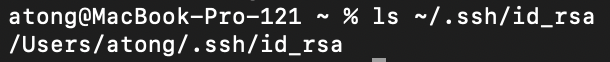
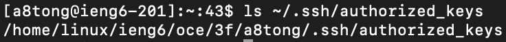
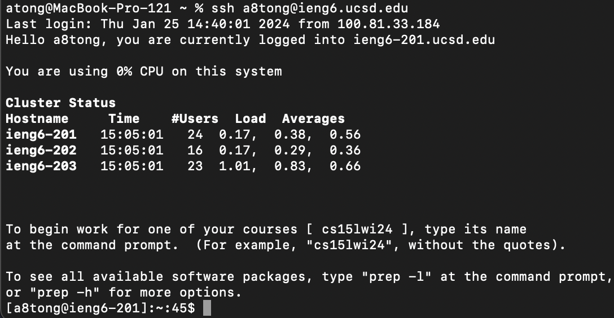

# Lab Report 2
#### Anthony Tong, CSE 15L | PID A17720195

## Part 1: Creating a Chat Server

Our goal for this lab report is to create a chat server, where we can send messages by accessing the path `/add-message` and making a query with `s=<message>` and `user=<username>`. For example, we should be able to access our web server and add a message with the following url:
```https://localhost:4000/add-message?s=HelloWorld&user=atong```

Below is the implementation for the code.

```java
import java.io.IOException;
import java.net.URI;
import java.util.ArrayList;

class Handler implements URLHandler {
    static final String format = "%s: %s";
    ArrayList<String> messages = new ArrayList<>();

    public String handleRequest(URI url) {
        if (url.getPath().equals("/")) {
            // print out the message history
            return String.join("\n", messages);
        } else {
            if (url.getPath().contains("/add-message")) {
                // split into parameters
                String[] parameters = url.getQuery().split("=|&");

                // make sure there is 4, and check manually for right format
                if (parameters.length != 4) { return "Error in your syntax"; }
                if (parameters[0].equals("s") && 
                        parameters[2].equals("user")) {
                    // add message to the ArrayList
                    messages.add(String.format(format, parameters[3], 
                                               parameters[1]));
                    // print message history
                    return String.join("\n", messages);
                } else { return "Error in your syntax"; }
            }
            return "404 Not Found!";
        }
    }
}

class ChatServer {
    public static void main(String[] args) throws IOException {
        if(args.length == 0){
            System.out.println("Missing port number! Try any number between 1024 to 49151");
            return;
        }

        int port = Integer.parseInt(args[0]);

        Server.start(port, new Handler());
    }
}
```

Here are a few examples of our code running:


We can break down our query

```http://localhost:4000/add-message?s=Hello%20World!&user=atong```

into little parts. First, when we access the URL `http://localhost:4000`, we trigger the `Server` object in the `ChatServer` class to call `handleRequest`, located in the `Handler` class. When this happens, we have access to the entire URI above. We can therefore find the request path, in our case `/add-message`, by calling `url.getPath()`. Once we have entered this block, we confirm that the input query is valid, i.e. it must fit the format `s=<message>&user=<username>` by splitting the arguments into 4 items. 

Once we have validated that the request is properly formatted, we simply add our chat message to an ArrayList stored as an instance variable `messages` in the Handler class. Notice that there is also a formatting string neatly placed as a constant in the class that we can use to template our message format. When we add our chat message, then `messages` gets updated with an additional entry, temporarily stored in memory -- when we restart the server, all of our updates will be lost. 

What happens if we try to make an invalid request?


Here, when we parsed in our query, we called the split method and realized there were only 2 components! As a result, we detect that it is an invalid query, and return an error.

## Part 2: SSH

We set up SSH public key authentatication into `ieng6.ucsd.edu`.

Path to our private key file:



Path to our public key file on `ieng6.ucsd.edu`:



Example of logging in without entering passwords:



## Part 3: What I Learned

These two labs were just a review of my ability to navigate the terminal, and it seems I remember them.