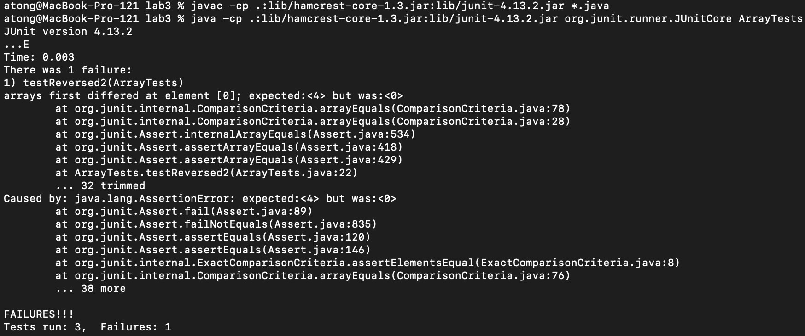
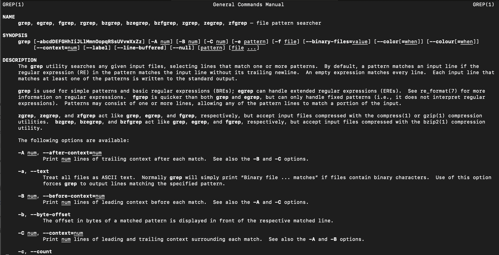

# Lab Report 3
#### Anthony Tong, CSE 15L | PID A17720195

## Part 1 - Bugs

We can take the first bug, in the `ArrayExamples.java` `reversed()` method.

- A failure-inducing input for the buggy program, as a JUnit test and any associated code (write it as a code block in Markdown)

Almost any input works:

```java
int[] input = {1, 2, 3, 4};
int[] output = ArrayExamples.reversed(input); // ends up being {0, 0, 0, 0}
```

- An input that doesn't induce a failure, as a JUnit test and any associated code (write it as a code block in Markdown)

We can sub an array with default 0s:

```java
int[] input = {0, 0, 0, 0};
int[] output = ArrayExamples.reversed(input); // ends up being {0, 0, 0, 0}
```

- The symptom, as the output of running the tests (provide it as a screenshot of running JUnit with at least the two inputs above)

The symptom, as we can see, is that the output always ends up being 0. The first example fails as `testReversed2()` and the second example succeeds as `testReversed()`:

```java
@Test
public void testReversed() {
    int[] input1 = {0, 0, 0, 0};
    assertArrayEquals(new int[]{0, 0, 0, 0}, ArrayExamples.reversed(input1));
}

@Test
public void testReversed2() {
    int[] input1 = {1, 2, 3, 4};
    assertArrayEquals(new int[]{4, 3, 2, 1}, ArrayExamples.reversed(input1));
}
```



- The bug, as the before-and-after code change required to fix it (as two code blocks in Markdown)

We can see that the bug is because we set `arr` values to `newArray` values instead of setting `newArray` values to `arr` values, and we also need to adjust the return to return `newArray`.

Before:
```java
static int[] reversed(int[] arr) {
    int[] newArray = new int[arr.length];
    for(int i = 0; i < arr.length; i += 1) {
        arr[i] = newArray[arr.length - i - 1];
    }
    return arr;
}
```

After:
```java
static int[] reversed(int[] arr) {
    int[] newArray = new int[arr.length];
    for(int i = 0; i < arr.length; i += 1) {
        newArray[i] = arr[arr.length - i - 1];
    }
    return newArray;
}
```

## Part 2 - Researching Commands

Let's research the command `grep` today. We already saw in the lab that you can use `-r` to search recursively through directories, and `-l` to list the filenames rather than the lines in which we found the occurrences. We can use `man` to learn more about the command and its options:



### Regex matching

We can already see from the description that `grep` supports basic regex (regular expression) patterns. Previously in the labs we have only searched for explicit terms, but regex allows us to search for more general patterns! The `grep` manual entry has a few examples of these regex expressions. Our first example will be to search the occurrences of `computer` at the *beginning* of the line, using the carat (^) operator to denote a newline. That is, if "computer" is not the first word in the line, we skip it! Also, we will use `head -10` to display only the first 10 occurrences, as there are too many:

```
$ grep -r '^computer' technical | head -10

technical/government/About_LSC/Strategic_report.txt:computers in each of Guam's 21 mayors' community offices; another
technical/government/About_LSC/State_Planning_Report.txt:computer terminals to easily access forms and information. In its
technical/government/Env_Prot_Agen/ctf7-10.txt:computer, if necessary.
technical/government/Alcohol_Problems/Session2-PDF.txt:computerized format. It addresses problems over the patient's
technical/government/Alcohol_Problems/Session2-PDF.txt:computer feedback, need to be explored.
technical/government/Alcohol_Problems/Session2-PDF.txt:computer-administered formats. Alcohol Clin Exp Res
technical/government/Alcohol_Problems/Session3-PDF.txt:computer-based intervention for screening and health promotion in
technical/government/Alcohol_Problems/Session3-PDF.txt:computerized, tailored messaging represents an important technique
technical/government/Alcohol_Problems/Session3-PDF.txt:computer programs on laptops or palm computers, web-based
technical/government/Alcohol_Problems/Session3-PDF.txt:computer-based screening. He said funding mechanisms such as small
```

What about some other regex patterns? We have already seen the asterisk (*) operator, now we can use the or (|) operator to search for multiple possible expressions that don't overlap. Note that here we will have to use `egrep` as `grep` cannot handle such an expression. Let's search for two obscure numbers, 837 and 1235:

```
$ egrep -r '837|1235' technical 

technical/government/Alcohol_Problems/Session4-PDF.txt:JAMA 1991;266:2837-42.
technical/government/Gen_Account_Office/Testimony_Jul17-2002_d02957t.txt:(GAO-01-837, August 31, 2001).
technical/biomed/1471-2164-2-9.txt:          domain (aa 505-837) conserved in the three previously
technical/biomed/1471-2164-2-9.txt:          protein (1-350 and 350-837) have well-defined and
technical/biomed/1471-2350-3-12.txt:          705delG: 1160+, 1240-; 1155del32: 2996+, 1235-). The
technical/biomed/1471-2164-3-27.txt:        numbers BI183743, BI186313, and BG894921 represent
```

These are just two things you can do with regex pattern matching in grep!

### exclude-dir

As we scroll through, we see an interesting option, `--exclude-dir`. Its description is as follows:

> If -R is specified, it excludes directories matching the given filename pattern from the search.  Note that --exclude-dir and --include-dir patterns are processed in the order given.  If a name matches multiple patterns, the latest matching rule wins.  If no --include-dir pattern is specified, all directories are searched that are not excluded.

Interesting! This immediately makes us think about trying to find occurrences in a big project, where we want to include or exclude certain directories while recursively searching. Suppose we have a `hidden` directory that we don't wish to search through. Then we can use `grep -r --exclude-dir hidden <pattern> <file/dir>`, and it will be excluded! We can try this on the `technical/government` folder, excluding the `About_LSC` directory. Let's sort it afterwards and show the first few outputs:

```
$ grep -rl --exclude-dir About_LSC hi technical/government | sort | head -10

technical/government/Alcohol_Problems/DraftRecom-PDF.txt
technical/government/Alcohol_Problems/Session2-PDF.txt
technical/government/Alcohol_Problems/Session3-PDF.txt
technical/government/Alcohol_Problems/Session4-PDF.txt
technical/government/Env_Prot_Agen/1-3_meth_901.txt
technical/government/Env_Prot_Agen/atx1-6.txt
technical/government/Env_Prot_Agen/bill.txt
technical/government/Env_Prot_Agen/ctf1-6.txt
technical/government/Env_Prot_Agen/ctf7-10.txt
technical/government/Env_Prot_Agen/ctm4-10.txt
```

Indeed, no files from `About_LSC` were revealed when searching for `hi`. Just to confirm that there is occurrences of `hi` in `About_LSC`, let's include it again:

```
$ grep -rl hi technical/government | sort | head -10

technical/government/About_LSC/CONFIG_STANDARDS.txt
technical/government/About_LSC/Comments_on_semiannual.txt
technical/government/About_LSC/LegalServCorp_v_VelazquezDissent.txt
technical/government/About_LSC/LegalServCorp_v_VelazquezOpinion.txt
technical/government/About_LSC/LegalServCorp_v_VelazquezSyllabus.txt
technical/government/About_LSC/ODonnell_et_al_v_LSCdecision.txt
technical/government/About_LSC/ONTARIO_LEGAL_AID_SERIES.txt
technical/government/About_LSC/Progress_report.txt
technical/government/About_LSC/Protocol_Regarding_Access.txt
technical/government/About_LSC/Special_report_to_congress.txt
```

There's our first example! `--exclude-dir` is neat; suppose we have a lot of folders and we only want to exclude one from our search; `--exclude-dir` is our hero there. As we look through the description of `--exclude-dir`, we realize it can be chained with `--include-dir` as well. 

What if we want to exclude two directories? Let's also exclude `Alcohol_Problems`. Just use it twice:

```
$ grep -rl --exclude-dir About_LSC --exclude-dir Alcohol_Problems hi technical/government | sort | head -10

technical/government/Env_Prot_Agen/1-3_meth_901.txt
technical/government/Env_Prot_Agen/atx1-6.txt
technical/government/Env_Prot_Agen/bill.txt
technical/government/Env_Prot_Agen/ctf1-6.txt
technical/government/Env_Prot_Agen/ctf7-10.txt
technical/government/Env_Prot_Agen/ctm4-10.txt
technical/government/Env_Prot_Agen/final.txt
technical/government/Env_Prot_Agen/jeffordslieberm.txt
technical/government/Env_Prot_Agen/multi102902.txt
technical/government/Env_Prot_Agen/nov1.txt
```

Done!

### word-regexp

When we searched for `hi` earlier in the government folder, we end up searching for *any* occurrence of `hi`, even if it is not a standalone word. Suppose we wanted to search for `hi` as a word by itself; we'd specify the `-w` option to specify for full words only. Here's the `man` entry:

> The expression is searched for as a word (as if surrounded by ‘[[:<:]]’ and ‘[[:>:]]’; see re_format(7)).  This option has no effect if -x is also specified.

Let's try this on the `technical` directory as a whole:

```
$ grep -rw hi technical

technical/plos/journal.pbio.0030032.txt:        universities, and hi-tech certification programs; the proliferation of degrees in general,
technical/biomed/1471-2172-3-12.txt:          DP can be further subdivided into CD25 hi, CD25 lo, and
```

We see that it works as intended! Remember earlier that we can use regex to search only from the start of the line. Let's search for occurrences of `computer` as a *word*, at the *start* of the line:

```
$ grep -rw '^computer' technical | head -10

technical/government/About_LSC/State_Planning_Report.txt:computer terminals to easily access forms and information. In its
technical/government/Env_Prot_Agen/ctf7-10.txt:computer, if necessary.
technical/government/Alcohol_Problems/Session2-PDF.txt:computer feedback, need to be explored.
technical/government/Alcohol_Problems/Session2-PDF.txt:computer-administered formats. Alcohol Clin Exp Res
technical/government/Alcohol_Problems/Session3-PDF.txt:computer-based intervention for screening and health promotion in
technical/government/Alcohol_Problems/Session3-PDF.txt:computer programs on laptops or palm computers, web-based
technical/government/Alcohol_Problems/Session3-PDF.txt:computer-based screening. He said funding mechanisms such as small
technical/government/Alcohol_Problems/Session4-PDF.txt:computer-based methods. While emergency physicians may not have the
technical/government/Gen_Account_Office/d0269g.txt:computer specialists, but who may have useful program or financial
technical/government/Gen_Account_Office/d0269g.txt:computer databases to periodic meetings of individuals to share
```

We used `head -10` to only display the first 10 lines, as there were a lot in the output! There's our second option for `grep` covered.

### Context

If we have a match, what if we want to see a few lines before or after? We can use the `-A`, `-B`, or `-C` options to specify a number of lines before, after, or around each context. `-A` represents after, `-B` represents before, and `-C` represents around. Let's try using `-C` when searching for `hi`:

```
$ grep -rw -C 3 hi technical

technical/plos/journal.pbio.0030032.txt-        Marketplace , argues that converging market forces will lead to the success of the
technical/plos/journal.pbio.0030032.txt-        professional master's degree in science. These forces include: rapid technological change;
technical/plos/journal.pbio.0030032.txt-        the rise of alternative learning channels such as online and distance education, corporate
technical/plos/journal.pbio.0030032.txt:        universities, and hi-tech certification programs; the proliferation of degrees in general,
technical/plos/journal.pbio.0030032.txt-        and in multidisciplinary fields specifically; and a fundamental societal shift away from
technical/plos/journal.pbio.0030032.txt-        public service and toward entrepreneurship, profitability, and competition.
technical/plos/journal.pbio.0030032.txt-        Kenneth R. Smith, former dean of the Eller College of Business and Public Administration
--
technical/biomed/1471-2172-3-12.txt-          from cell cycle analysis suggesting that a discrete CD44
technical/biomed/1471-2172-3-12.txt-          -25 lopopulation with a specific proliferation profile
technical/biomed/1471-2172-3-12.txt-          can be identified, such that the transition from TN3 to
technical/biomed/1471-2172-3-12.txt:          DP can be further subdivided into CD25 hi, CD25 lo, and
technical/biomed/1471-2172-3-12.txt-          CD25 -subsets [ 12 13 ] . Analysis of proliferation using
technical/biomed/1471-2172-3-12.txt-          these more narrowly defined subsets still showed values
technical/biomed/1471-2172-3-12.txt-          similar to wild type in the CD44 -25 losubset (Fig.
```

We can see that we have printed 3 lines before and after the occurence of `hi` for the two word occurrences (`-w`) of `hi` in `technical`. Let's try the before option only:

```
$ grep -rw -B 3 hi technical

technical/plos/journal.pbio.0030032.txt-        Marketplace , argues that converging market forces will lead to the success of the
technical/plos/journal.pbio.0030032.txt-        professional master's degree in science. These forces include: rapid technological change;
technical/plos/journal.pbio.0030032.txt-        the rise of alternative learning channels such as online and distance education, corporate
technical/plos/journal.pbio.0030032.txt:        universities, and hi-tech certification programs; the proliferation of degrees in general,
--
technical/biomed/1471-2172-3-12.txt-          from cell cycle analysis suggesting that a discrete CD44
technical/biomed/1471-2172-3-12.txt-          -25 lopopulation with a specific proliferation profile
technical/biomed/1471-2172-3-12.txt-          can be identified, such that the transition from TN3 to
technical/biomed/1471-2172-3-12.txt:          DP can be further subdivided into CD25 hi, CD25 lo, and
```

Cool! We can find the context for which certain patterns are found. This concludes the lab 3 report!